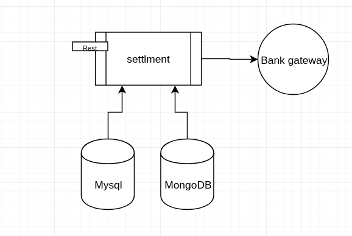

Settlement module
=================
An automatic accounting service to settle with end-users.
It present Rest-API to communicate with and start to calculate user balance and settle with them.



in-order to decrease balance calculation load on databases, fist of all we got a time and find active drivers; 
It mean that we find drivers who they have at least one ride after that time. the balance calculation is done for them.

the service is working with `rides` and `drivers` mongo collections to find rides and drivers banking info based on ride **createdDate**.
We have transaction information in `entry_transaction` Mysql table.

After calculation time the settle requests are sent to bank gateway.
the service based on what time you configure can recheck the settlement state or rollback on settlement failed.

Configuration
-------------
```properties
spring.data.mongodb.database=database
spring.data.mongodb.host=localhost
spring.data.mongodb.password=password
spring.data.mongodb.username=settlement

spring.datasource.url=jdbc:mysql://localhost:3306/maxxi-wallet?useUnicode=true&useJDBCCompliantTimezoneShift=true&useLegacyDatetimeCode=false&serverTimezone=Asia/Tehran
spring.datasource.username=root
spring.datasource.password=root
spring.jpa.properties.hibernate.dialect=org.hibernate.dialect.MySQL5InnoDBDialect
spring.jpa.hibernate.ddl-auto=update

settlement.payment.inquiry-cron=0 * 9 * * ?

settlement.gateway.pasargad.username=username
settlement.gateway.pasargad.private-key-path=/absolute/path/to/Private.pem
settlement.gateway.pasargad.source-deposit=source-deposit
settlement.gateway.pasargad.max-transaction-per-batch=100
#millisecond
settlement.gateway.pasargad.delay-between-requests=100

settlement.skip-settle-for-bank=آرمان
# Rial
settlement.min-charge-to-pay=10000
settlement.max-charge-to-pay=5000000
settlement.settle-drivers=a,b,c

#logging.level.root=debug
```

Installation
------------
1. clone the code
2. mvn clean package (the java version must be JDK 1.8)
3. scp create jar file to target server
5. configure service with a `application.properties` file in a `config` directory beside jar file  
4. run application with `java -jar <JAR_FILE>.jar`